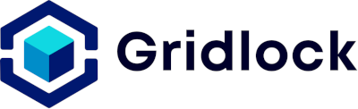
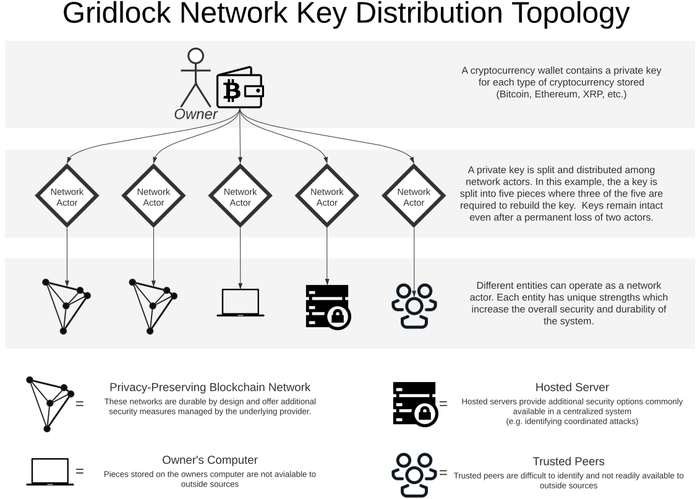

## A secure and private cryptocurrency storage platform

Author: Derek Rodriguez   Contributors: Francesca Sage-Ling, Kiran Fitzsimons, Artur Frenszek-Iwicki, Shane Moloney, Daniel Marzec, Chris Smith, Franklin Willemen, Laura Weindorf

Learn more at on the [website](https://gridlock.network) 
Questions? [devs@gridlock.network](mailto:devs@gridlock.net)  v1.8 January 2022

### Abstract 

Gridlock is a distributed keystore built using a grid of storage participants to securely lock cryptocurrency assets and sensitive information without the use of a centralized authority. It provides managed security and usability of an exchange with the control and privacy of personal storage. The network uses two primary mechanisms for increased security. The first is Enigma’s Secret Network, which implements Intel Trusted Execution Environments (TEEs) to ensure secrecy of stored information. This protects against the collusion of storage nodes and allows Gridlock to safely replicate key shares across many devices, significantly improving the durability and reliability of the stored asset. The second is the use of full-threshold ECDSA signature scheme (TSS), a t-of-n signature scheme, with a minimum recommended rebuild threshold of 3 out of 5 shares. Key shares are split and distributed to multiple storage devices, with each device adding protection from differing attack vectors and failure points, thereby increasing the overall strength of the distributed keystore. The combination of these two technologies allows us to capitalize on the strengths of TEEs while mitigating risks associated with side-channel attacks that compromise those strengths. The network offers professional key management with guarantees of security and privacy, not possible with any other cryptocurrency storage solution. 

## Overview

[Problem/Solution](#problem--solution) 

- Problem
- Solution

[Network Architecture](#network-architecture)

- Primary devices 
- Additional devices
- Intel Trusted Execution Environments (TEEs)
- Full-threshold ECDSA Threshold Signature Scheme (TSS)
- Side-channel attacks

[User Experience](#user-experience) 

- Vault Generation
- Funds Transfer and Transaction Signing
- Account Recovery

[Technical Process Flow](#technical-process-flow) 

- Vault Generation
- Key Generation
- Transaction Signing
- Fading Security

[Attack Vectors](#attack-vectors)

- Communication Hub Takeover
- Coordinated Device Attacks
- Stolen Credentials
- Internal Attack

[Advanced Features](#advanced-features)

- Multi-sig Accounts 
- One-way Asset Flow
- Asset Management
- Watchlight Service

[Conclusion](#conclusion) 

[References](#references) 

## Problem / Solution

### Problem

Cryptocurrency users have two options when storing assets, either with a third-party exchange or a personal wallet. Both options have drawbacks covering privacy, usability, and security. Some of these deficiencies are significant and can ultimately lead to a loss of all assets.

Exchanges are centralized entities with complete control over a user’s funds and knowledge of their identity. Users are subject to arbitrary transaction delays and withheld assets based on the whims of the exchange. Furthermore, all assets are lost if an exchange is hacked [1], goes out of business, exit scams, or is otherwise shut down [2]. Numerous exchanges have shut down in one of these ways, leading to the saying “Not your keys, not your coins”. The saying promotes storage of crypto assets in personal wallets outside the ultimate control of exchanges.

Personal wallets hand control back to the user, but that control is a double-edged sword. Full control means a user is solely responsible for the management and security of their private keys. All assets vanish if a private key is lost or stolen. Most wallets do have backup mechanisms, namely mnemonic phrases, which allow users to recover lost keys. However, the problem with this “solution” is the fact that the backup mechanism itself is a single point of failure. If a user’s mnemonic phrase is lost or stolen, all assets are lost. Additionally, personal wallets are often lacking blockchain integrations leading to poor usability [3] and are generally difficult to manage.

Other solutions like hardware wallets, smart contract wallets, or multi-sig wallets add value in one way or another, but all still have problems with security and usability [4] [5]. The community needs a solution that doesn’t sacrifice privacy in the name of usability or usability in the name of security.

### Solution

Gridlock overcomes problems with security, usability, and privacy by distributing a user's private keys across multiple devices. 

Keys are split into key shares using the full-threshold ECDSA signature scheme [7], which requires a designated threshold of shares before the key is used. The initially recommended threshold is 3 of 5, meaning that five key shares are distributed, and three must come together to rebuild the key. Shares are distributed among participating network devices for storage. 

The primary tool for key storage is Enigma's Secret Network [8], making Gridlock a network of networks. Enigma's network ensures the secrecy of shares by mandating that nodes running the network use Intel's trusted execution environments (TEE), known as enclaves, for computations and data storage [9]. This feature encrypts sensitive data, hiding it from everyone, including the node operator. It offers availability benefits of distributed storage and mitigates the risk of dishonest node operators.

Enigma enclaves are susceptible to side-channel attacks which allow hackers or node operators to break the security of an enclave [10]. The viability of these attacks is questionable outside an academic setting, given an appropriately coded protocol, but still worth consideration given the value of the stored asset. For private keys, in particular, the potential loss is too great to rely solely on the unbreakability of an enclave. For additional security, secondary non-Enigma devices are necessary. 

Secondary network devices provide insurance against the possibility of cracked enclaves in Enigma's network. Additional devices include personal devices, trusted acquaintance devices, personal cloud devices, and trusted key store services like Gridlock Watchlight. The variety of each device increases network security by varying the attack surface, so a flaw in a subset of network devices does not mean a loss of assets. 

Gridlock is more usable than personal wallets since users are not required to manage the security of their keys. It is more usable than exchanges because the owner has sole control of the asset and the network is not *able* to impose restrictions to blockchain service integration that exchanges can impose. Exchanges are dis-incentivized to connect to new blockchain services that compete with their suite of products. 

Finally, Gridlock has guaranteed privacy with identity and authentication information hashed client-side which means no storage device knows the identity of the owner and devices are not capable of impersonating a user, even if their storage is compromised. From an outside perspective, the network is capable of further asset obfuscating by pooling assets and maintaining an internal and private ledger of accounts. Internal account ledgers are both private and verifiable, leading to a product that is private by default. 

## Network Architecture

Key shares are distributed across multiple devices to gain the security benefits of each. The [key share topology document ](https://github.com/GridlockNetwork/Resources/blob/master/documentation/Gridlock%20-%20Key%20Distribution%20Topology.pdf)shows a default 3-of-5 key share distribution. 

### Primary device(s)

Enigma's privacy-preserving network is the primary share store option in Gridlock's network due to its high availability and usage of secure TEE enclaves. We plan to use this network to store multiple key shares, as long as the network does not control a majority of shares. This strategy allows Gridlock to leverage the strength of a privacy-preserving network while removing the risks associated with compromised TEE enclaves.

### Additional devices

##### Personal Device

Gridlock uses a client-side application for vault generation and usage. The application is also a storage participant and can encrypt and store a share of the private key. Users can add more devices of the same type with additional personal devices or hardware-based key storage devices. 

##### Personal Cloud Device

Microservers and microservices allow users to store personal data on a cloud server. These servers are affordable, always online, and always in the owner's control. Gridlock aims to work with cloud providers to make the creation of these devices as easy as a click of a button. 

##### Acquaintance device

One or more trusted acquaintances can store a key share using the client-side application with minimal effort. The storage and use of a share do not require any input from the acquaintance beyond the initial acceptance. For transaction signing, the device must be online to provide their share of the signature; therefore the use of acquaintance devices is limited to half of the total participating devices, m-1, to ensure constant availability. 

##### Trusted service

A trusted key store service, like Gridlock Watchlight, can store a key share and provide additional protection not available in other "passive" storage options. This option adds benefits of modern FinTech security practices, like suspicious transactions, without the ultimate control of a full key store service. 

### Intel Trusted Execution Environments (TEEs)

The Secret Network is solving the major issues of privacy and scalability currently impacting available public blockchains and decentralized application platforms. The network leverages Trusted Execution Environments (TEE), using Intel's Software Guard Extensions(SGX) technology, to protect data from unwanted observers while still allowing for computations using the data. TEEs use public-key cryptography to encrypt data within a secure area of a CPU, called an enclave. A private key is created at the time of CPU fabrication and is never stored anywhere other than the enclave. Information entering or leaving the enclave is encrypted with its private key to protect it from unwanted observers. Intel’s TEEs enable the execution of security-critical application code in isolation, even when running on an untrusted device. 

This technology reduces the attack surface significantly(App + Processor) and offers a scalable security solution in a mainstream environment. This architecture is especially useful in cloud computing applications where users outsource data processing to external infrastructure. It allows for secure computations and storage without the need to trust the cloud provider or software stack.

### Full-threshold ECDSA Threshold Signature Scheme (TSS)

Full-threshold Elliptic Curve Digital Signature Algorithm(ECDSA) is a standardized signing algorithm. It allows for the distributed key generation and transaction signing across <code>n</code> parties. Full-threshold means that any t-out-of-n parties can sign a message; thus, this protocol would allow distributed signing and key-generation with any <code>t <= n</code>. Securely computing ECDSA in a distributed manner, means that a <code>t-of-n</code> threshold is needed for the protection of the private key. Splitting the secret key between multiple devices avoids a single point of failure since no single device has access to the full private key. A <code>t-of-n</code> threshold signature ensures that any <code>t+1</code> devices which store a piece of the private key can jointly sign a message, but no colluding parties can forge a signature. 

For more details on full-threshold ECDSA for distributed key generation and signing the reader is referred to the paper by Gennaro and Goldfeder [7].

### Side-channel attacks

A side-channel attack is an attempt to gain access to a system using additional (side-channel) information that should not be revealed. An analogy of such an attack is the use of a stethoscope to open a safe. The sound of the clicking tumblers is additional and unintentionally revealed “side-channel” information. The analogous safe in cryptography is a Trusted Execution Environment (TEE) which is used to process and store sensitive information. The encryption protecting this information is presumed unbreakable, but there exist side-channel attacks that can circumvent it entirely. Modern-day attacks draw on complex information like electromagnetic distortions and nanosecond delays. Improvements are constantly made to reduce the amount of information leaked, but as it goes with anything of value, there will always be a better safe, and there will always be a better thief. 

The problem with modern privacy-preserving networks is that they rely too heavily on the guarantees of an unbreakable enclave. If a single enclave is broken, the entire network is compromised. Some argue that side-channel vulnerabilities are exaggerated and pose no real-world risk, but testing those claims with information of significant value is not appealing. Rather than joining the race to “build a better safe”, we take a different approach. We eliminate the risk of any compromised network by utilizing multiple storage devices. We split a private key into pieces such that any single piece is not usable by itself. To rebuild a key, we must combine a subset of pieces to meet a specified threshold (e.g. 3 of 5). This solution has the combined security of all devices and dramatically reduces the risk of possibly compromised enclaves. 

## User Experience

### Vault Generation

New users generate a Gridlock vault by creating an "account" with Gridlock and defining an identity and log-in credentials. The identity consists of non-private information, such as full name and government ID, and access credentials, which are a combination of password, 2FA, biometrics, etc. This information is required so decentralized devices can uniquely identify the user. All information is hashed client-side, so the identity of the user remains secret. 

Once the user has created a vault, they can generate addresses for each cryptocurrency they wish to store. 

### Funds Transfer and Transaction Signing

Users transfer funds into the network by sending their assets to the crypto addresses generated with Gridlock. Note: It is possible to use existing addresses and private keys, but users are not afforded the extra security of a decentralized key generation process where the full key is never, at any time, available to a single device and not subject to risk that device being compromised.  

To transfer funds out of the network or sign transactions, users must authenticate with the network and request each device's portion of the signature. This work is done without user interaction. All the user has to do is confirm their identity and access credentials and transmit that information along with the transaction they wish to perform. 

### Account Recovery

Traditional account recovery mechanisms often require that users give up their privacy and autonomy to a central authority. Gridlock aims to solve that problem with the first truly decentralized recovery system.

There are struggles with this goal, particularly when it comes to account recovery. If there is no central authority to fall back on, we must consider how to best walk the line between security and usability. We feel we've solved this problem by introducing the concept of *fading security*. 

Fading security is the process in which the credentials required to access a vault are systematically reduced until access is re-established. If something goes wrong and a user cannot access their vault, they only have to wait until the fading security mechanism catches up to a point where they can re-establish access. This can potentially lead to inconveniences, but it is a preferred option to gain increased security and privacy. Additionally, cases of severe inconvenience are rare and can be mitigated with the right operational layer that balances a users security and usability requirements. 

## Technical Process flow

### Vault Generation

The user provides multiple pieces of identification information (i1, i2 ... in), such as name and a government ID, and credential information (c1, c2 ... cn), such as password and either a 2FA or a biometric key. Using the provided information, Gridlock will construct a custom Merkle tree combining each element. This allows us to generate password tiers used by the fading security engine (see below). 

Prior to transmittal, each data element is hashed client-side using Argon2d with a moderately large number of iterations. The assumption is that crypto transactions are not extremely common, so a multi-second wait is a fair trade-off for increased protection against brute-force attacks. Additionally, the finality time of many blockchains makes the extended client-side delay negligible (i.e. a three-second wait for a Bitcoin transaction, which takes an average of 10 minutes to finalize). 

We will create n sets of hashed credentials for each participating device to create unique hashed sets for each participant. Aragon2 automatically provides a unique salt per hash. This allows us to protect against user impersonation between devices. In other words, the H(c1) on one device will not match H(c1) on another device. Compromised devices cannot coerce additional key shares using their hashed credentials. 

### Key Generation

Distributed key generation ensures that the private keys are never fully available, which eliminates problems with potentially compromised nodes. 

Before user interaction, private-public keypairs are generated for all supported blockchain assets, reducing the vault generation time for new users. Keys are stored in the system and available for user association once a user account is created. 

### Transaction Signing

There are two proposed states for transaction signing based on the maturity of the network. The first state incorporates a central communication hub, which significantly reduces many parts of the architecture. 

Note: The decision to include a central point of communication was not made lightly as it goes against the ethos of the blockchain community. With the understanding that a central communication-only hub *does not affect the security of the product*, we decided to incorporate this in the initial release while we stabilize the rest of the network. 

With this architecture, funds transfer and transaction signing occur as follows:

1) The user transmits one packet of transaction information to the communication hub for each participating storage device. Each packet contains the user's identity, credentials, and transaction information and is encrypted with the public key of the target storage device. The communication hub cannot access the contents of the packet and exists only to forward to the target storage device.

2) Each storage device validates the user's credentials. If accepted, it returns their portion of the signed transaction back to the communication hub. 

3) The communication hub combines all signature pieces and transmits the complete signed transaction to the correct blockchain network. 

The second state is much like the first, except it eliminates the communication hub. 

With this architecture, funds transfer and transaction signing occur as follows:

1) The user transmits one packet of transaction information for each participating storage device to *any* participating storage device. The first contacted device becomes the 'primary device' and is responsible for communication between other participants, as well as transaction signing. The primary device forwards transaction packets to their designated participants. 

2) Each storage device validates the user's credentials. If accepted, it returns their portion of the signed transaction back to the primary device. 

3) The primary device combines all signature pieces and transmits the complete signed transaction to the correct blockchain network. 

### Fading Security

Fading security guarantees access to the user's vault without centralized oversight. This is possible by reducing the requirements for access after a pre-determined time window has elapsed without the user making a connection. 

The following example shows how the security engine might reduce access requirements based on an arbitrary number of security elements or "checks". The system is designed to give precedence to stronger access credentials.

------

<code>G</code> = **G**uardians              <code>D</code> = **D**evice (2FA)                <code>P</code> = **P**assword

<code>B</code> = **B**iometric key        <code>A</code> = Sum of **A**ny checks    <code>C</code> = Total number of **C**hecks

<code>T</code> = number of **T**ime windows elapsed without access

------

The engine iterates through the defined logic whenever a user requests access. The system starts at a time window <code>T</code> of 0 and increments by 1 for each time new window without a successful connection. Once a connection is established, <code>t</code> is reset to 0. 

**Tier 0 :** Evaluate credentials and grant access if <code>C=B+D+P+A</code>

**Tier 1 :** If <code>C-T-2<=0</code> -> evaluate credentials and grant access if <code>C-T-2=B+D+A</code>

**Tier 2:** If <code>C-T-1<=0</code> -> evaluate credentials and grant access if <code>C-T-1=(B|D)+A</code>

**Tier 3:** If <code>C-T<=0</code> -> evaluate credentials and grant access if <code>C-T=A & A>0</code>

**Tier 4:** If <code>C-T=0 & A>0</code>  -> grant access if based on user identity only as long as the requestor submits the identity with ~$1 worth of cryptocurrency as collateral. This requirement deters network spamming by bots looking for open accounts.

**Tier 5:** Transfer funds to pre-defined Guardian

## Attack Vectors

Although we've gone to great lengths to ensure architectural security, a system is only as safe as its known attack vectors. We have identified four attack surfaces in the network.

### Communication Hub Takeover

As a centralized system, the communication hub is vulnerable to take over in a traditional sense. Full control of the communication hub is deemed low risk because, in the case of a complete takeover, the attacker only gains glean minimal information from the routing requests. Compromising this piece would give the attacker the ability to decrypt where messages are being sent but would not enable modification of transferred information. Because information integrity is preserved, an eavesdropper can gain information on device locations. The alternative to a communication hub is a fully distributed system where each device has full knowledge of all other devices in the network. In many ways, this central communication hub provides added security because it can obfuscate the location of other participating devices. If the hub goes offline permanently, devices can re-establish access with their peers by broadcasting their location to a wider audience until a peer is found. 

### Coordinated Device Attacks

By virtue of it's architecture, Gridlock accounts are protected even if 2/5 of the devices in a user's vault are compromised. Thus, a minimum viable attack would consist of taking over two enigma nodes and one additional node or, three additional nodes (the case of 1 enigma node + 2 additional nodes being trivial). This attack is, of course not specific to Gridlock architecture and is possible in any cryptocurrency wallet system, made easier by having a single key store for users. Gridlock is already guaranteed safer as it requires attackers to take over more than one system, but we address these concerns:

#### Enigma Node Attack

Enigma nodes utilize Intel Software Guard Extensions, which enable the execution of security-critical application code away from untrusted system software. This technology provides numerous safety guarantees that are much better than a standard compute server but is not an entirely secure system in its own right. In [10],  Lindell describes the extensive attack surface, including page, cache, energy management, and speculative execution side-channel attacks. Each of these attacks requires "rare and specialized expertise" to mitigate. This expertise is on the cutting edge, making Secret network attacks the bar to overcome. "Due to the rich variety of effective attacks, the assumption should be that data privacy is not afforded via software run inside an SGX." and is the exact reason why Gridlock enforces a minority share distribution on Enigma (e.g. 2 out of 5 nodes).
       

#### Non-Enigma Node Attack

Although the hardware security of additional nodes is comparatively lower to enigma nodes and thus more probable, Gridlock balances this by fragmenting the attack surface in multiple dimensions. The recommended Vault setup will involve a mix of differing hardware and software architectures. This improves strength by forcing attackers to exploit more than one architecture to compromise a vault, increasing difficulty exponentially for each added device. Architecture diversity does not protect against shared tenancy vulnerabilities which is why Gridlock users also benefit from fragmented device location. The protocol ensures each key share is not stored in the same environment, further isolating the threat of a compromised node.

The combination of Enigma and non-Enigma devices gives Gridlock's architecture better safety guarantees than any wallet architectures known today. 

#### Stolen Credentials

This attack surface is on the client side. This is mitigated using 2FA, which is an imperfect solution with known SIM-jacking techniques but easily blocked if any node in a users vault detects anomalous activity from the user. 

#### Internal Attack

An internal Gridlock developer might introduce backdoors into the code but would not be able to distribute that code to participants in the network. All released code will have many rounds of review, often including third-party security audits. Code that has been vetted will have a public hash shared with all network participants to ensure only trusted code is run. At this point, a Gridlock developer has no more power than any other person. 

## Advanced Features

### Multi-signature Accounts

Multi-signature accounts are as simple as supporting two or more identities with the same vault. Once added, future transactions require a defined subset of identities before a transaction is signed. The default is `n of n` identities but can be changed if approved by all parties. This option provides all the benefits of multi-sign authorizations without the weight of heavy multi-sig signatures on the blockchain. Since the approval logic is off-chain, the user can define granular logic beyond the standard yes-no logic in a multi-sig vault. 

Vaults can also store metadata to document the identities that authorized each transaction. The information is stored within the vault. This information allows users to keep an audit trail while maintaining on-chain privacy. 

### One-way asset flow

Periodic rotating of private keys is important to increase system security. This rotation reduces the time-window in which an attacker can obtain a private key. An attacker must compromise each device, storing a key share before the private key is changed. TSS-based vaults can rotate key shares to generate a different set of key shares while retaining the original public key. This mechanism is useful when users want to retain the public key for long-term use, but the typical user does not require this benefit.

It is, therefore, possible to have a public key for receiving funds only and a separate public key for sending funds. Put another way, all funds entering the system are not restricted to the public key used to import funds. Gridlock can freely rotate funds throughout the network as long as the user can track and transfer funds when desired. This rotation has enormous privacy benefits as the system becomes a mixer by default. 

### Asset Management

Gridlock is effectively non-custodial since no entity has control of stored funds. The only person able to access and control the funds is the owner. However, the system can include a permissions framework that allows for the assignment of granular permissions to specified services. Asset owners can define which services have access to funds and for what reason. For example, the owner can determine which services have access for investment purposes. This granular level of control allows for a marketplace of services that benefit both the user and the service provider. The inclusion of explicit permissions helps assuage consumer fears when considering new services. 

### Watchlight Service

Gridlock Watchlight is an add-on service that provides oversight protection for vault owners. The service does not have the ultimate control of a user's funds. Instead, it can closely monitor connected vaults and activity. This key share storage service adds the benefit of professional monitoring, which watches for suspicious transactions or coordinated attacks. This type of oversight is difficult with the standard distributed devices. If Watchlight identifies any suspicious activity, we can proactively notify the owner. This service bridges the gap between privacy and proactive monitoring. 

## Conclusion

Gridlock is the first truly secure and private cryptocurrency storage solution. Threshold Signatures combined with Trusted Execution Environments provide unparalleled security and availability, beyond any solution available today. The offloading of complex key management eliminates one of the biggest barriers to mainstream crypto adoption. The elimination of a central authority vastly increases security and maintains a user's privacy. 

## References 

[1] [List of cryptocurrency exchange hacks](https://selfkey.org/list-of-cryptocurrency-exchange-hacks/)

[2] [Mt Gox](https://www.wired.com/2014/03/bitcoin-exchange/)

[3] [Usability issues cryptocurrency wallets](https://www.researchgate.net/profile/Md_Sadek_Ferdous/publication/340630209_Examining_Usability_Issues_in_Blockchain-Based_Cryptocurrency_Wallets/links/5e95e00f92851c2f529f6e2c/Examining-Usability-Issues-in-Blockchain-Based-Cryptocurrency-Wallets.pdf)

[4] [Breaking Bitcoin Hardware Wallets](https://media.defcon.org/DEF%20CON%2025/DEF%20CON%2025%20presentations/DEF%20CON%2025%20-%20Datko-and-Quartier-Breaking-Bitcoin-Hardware-Wallets.pdf)

[5] [Multisig hack](https://loess.ru/pdf/2017-07-20_14.33.01%20https_blog.zeppelin.solutions_on-the-parity-wallet-multisig-hack-405a8c1.pdf)

[7] [One Round Threshold ECDSA with Identifiable Abort](https://eprint.iacr.org/2020/540.pdf)

[8] [Enigma: Decentralized Computation Platform with Guaranteed Privacy](https://arxiv.org/abs/1506.03471)

[9] [Intel SGX Product brief 2019](https://software.intel.com/content/dam/develop/public/us/en/documents/intel-sgx-product-brief-2019.pdf)

[10] [The Security of Intel SGX for Key Protection and Data Privacy Applications](https://cdn2.hubspot.net/hubfs/1761386/Unbound_Docs_/security-of-intelsgx-key-protection-data-privacy-apps.pdf)
